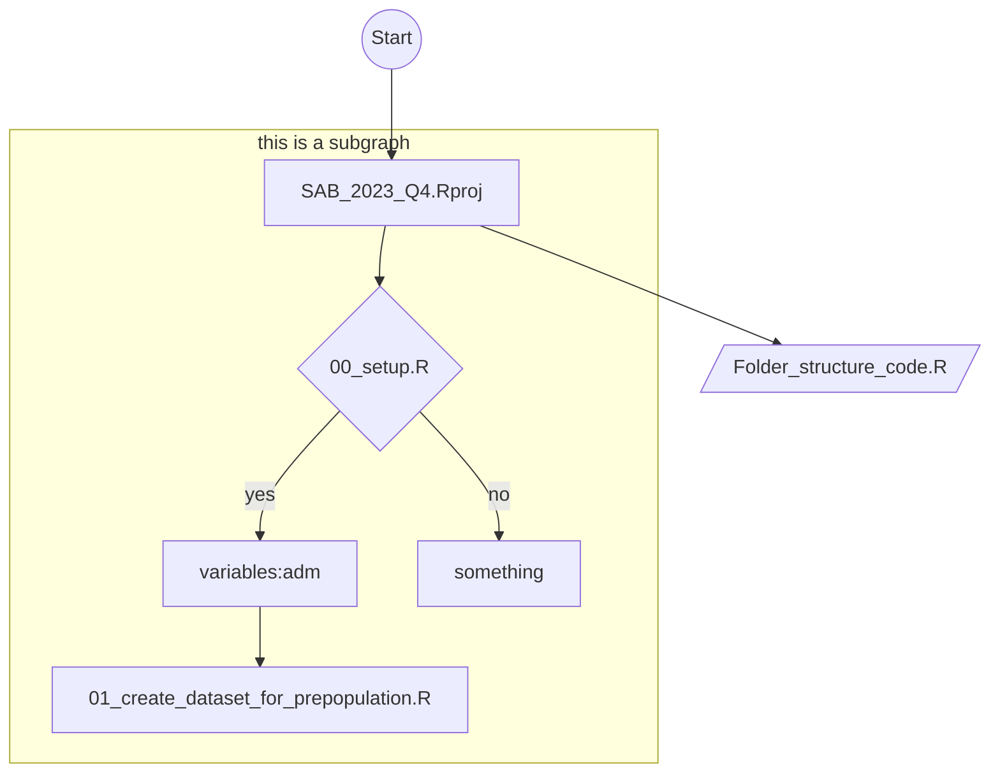

# mermaid
Testing creating mermaid diagrams

```mermaid
graph TD;
    A-->B;
    A-->C;
    B-->D;
    C-->D;
```

```mermaid
graph TB
        a((Start)) --> SAB_2023_Q4.Rproj --> id[/Folder_structure_code.R/]
        subgraph this is a subgraph
        SAB_2023_Q4.Rproj --> b{00_setup.R}  -- yes --> variables:adm --> 01_create_dataset_for_prepopulation.R
        b{00_setup.R} -- no --> something
        end
```
